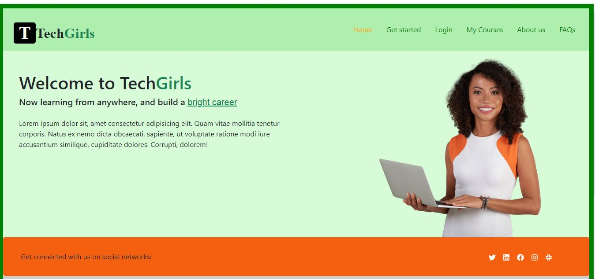
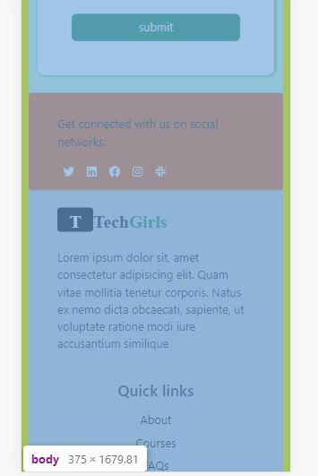
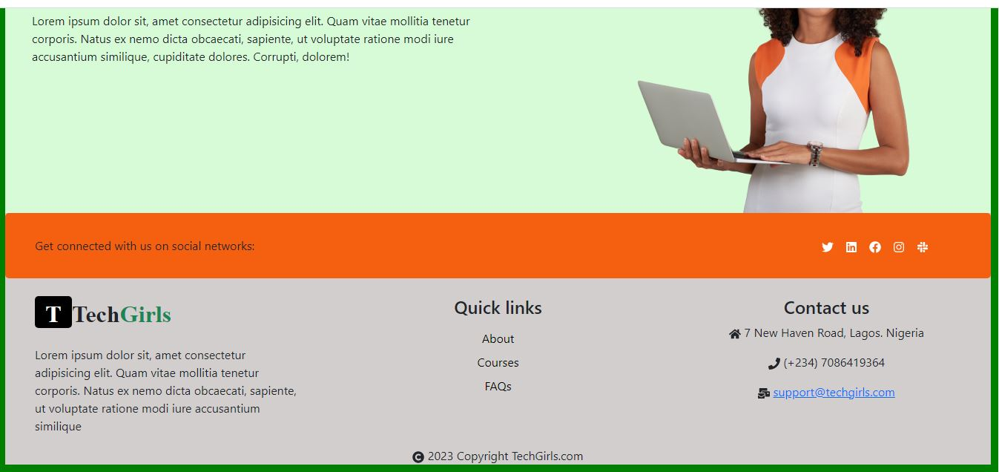
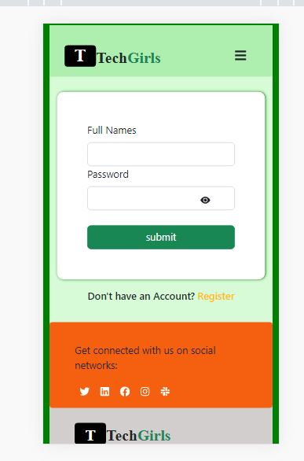
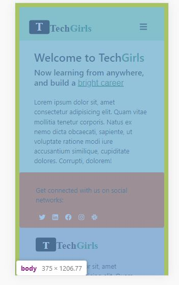
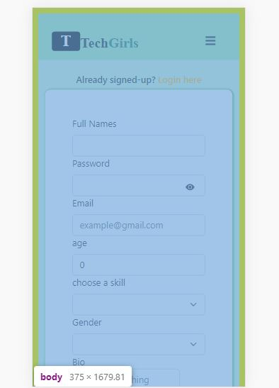

# TechGirls learning website

Welcome to TechGirls, a React.js application where women of any skill level can learn and built a career in tech!

## Description

TechGirls is a web application built with React.js that aims to make learning interactive and enjoyable. It provides a collection of tech related courses and allows users to test their knowledge. Whether you're a beginner learning new tech skills this platform offers a great way to challenge yourself and improve your skills.

## Screenshots of CodeQuiz app

  

    
    
    
     
      
       
  
 
 

## Deployment link  [Vercel link](https://quiz-app-one-sand.vercel.app/) and  [Netlify link](https://quiz-vite-app.netlify.app/)

- Interactive quizzes to test your React.js knowledge
- User-friendly interface for easy navigation
- Immediate feedback on quiz results
- Track your progress and improve your skills

## Styling 

## Installation

1. Clone the repository: `git clone https://github.com/nancy77zion/TechGirl-Learning-Site.git`
2. Navigate to the project directory: `cd [project folder]`
3. Install the dependencies: `yarn create vite`

## Usage

1. Start the application: `yarn dev`
2. Open your browser and visit `http://localhost:5173`
3. You will be greeted with the welcome screen of Quizzy.
4. Click on the "Get Started Here" button to start the quiz.
5. Answer the quiz questions and see your results.

## Contributing

Contributions are welcome! If you'd like to contribute to CodeQuiz, please follow these steps:

1. Fork the repository
2. Create a new branch: `git checkout -b <branch name>`
3. Make your changes and commit them: `git commit -am 'Added a new feature'`
4. Push to the branch: `git push origin <branch name>`
5. Submit a pull request

## Contact
Please feel free to reach out.

- Email: ebnancy710@gmail.com
- GitHub: [nancy77zion](https://github.com/nancy77zion)
- Twitter: [Eby_zion](https://twitter.com/Eby_zion)
- linkedln:[Eberechi Nwankudu](https://linkedin.com/in/eberechi-nwankudu)
